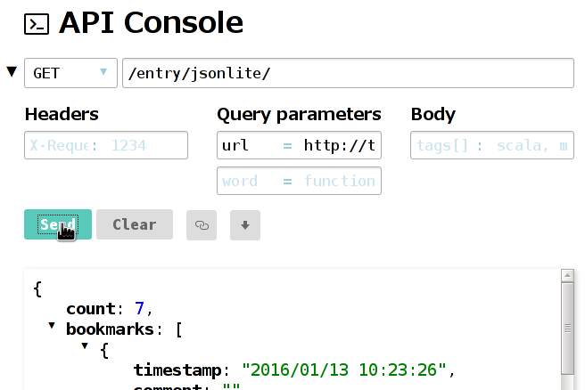

API Console
===========

Provide a web-based console view to manipulate APIs of an arbitrary website.



Install
-------

1. Install [golang][]
2. Run the following command

```
go get -u github.com/tarao/apiconsole
```

Console Server
--------------

Be sure that your `$GOPATH/bin` is in your `$PATH`.  To manipulate the
APIs of `http://example.com/` for example, run the console server as
the following.

```
apiconsole --upstream=http://example.com
```

Now `http://localhost:8000/devel/console/` provides a console view for you.

Console View
------------

### Request URL

As long as you properly specified the upstream host, the request URL
can simply be an absolute path without an origin part.  The console
server will proxy the request to the upstream host for you.  Be
careful if you specify a URL starting from the origin part (scheme +
host) and the request host is different from that of the console
server.  In this case, the response must come with CORS (
`Access-Control-Allow-Origin` header for example) or your browser
blocks the response.

### Response View

On Firefox, if you have an extension to prettify JSON document, JSON
responses are prettified in the console view.  Unfortunately, this is
not the case for Google Chrome.  If none of browser extension
prettifier is available, the console view automatically falls back to
prettifying by [highlight.js][].

LICENSE
-------

- Copyright (C) INA Lintaro
- MIT License

[golang]: https://golang.org/
[highlight.js]: https://highlightjs.org/
